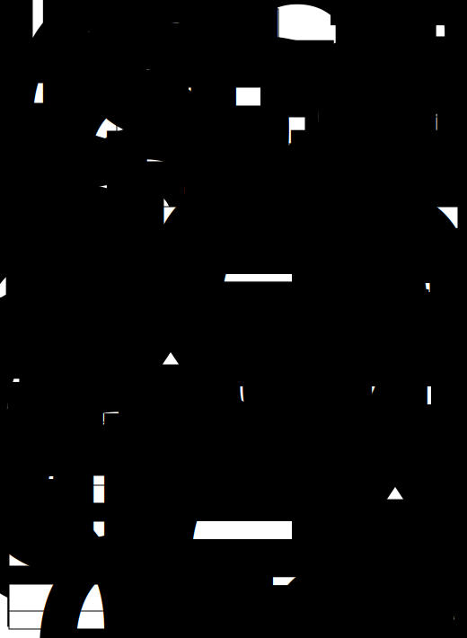

# Dataset Descriptions

For a detailed documentation of the dataset description format, refer to the thesis.
Below is an overview of the underlying model's structure.



## Example

In the following, an example is given for one [Eurostat](https://ec.europa.eu/eurostat) dataset about [unemployment in the member countries](https://ec.europa.eu/eurostat/web/products-datasets/-/teilm010).

```
@prefix rdf:      <http://www.w3.org/1999/02/22-rdf-syntax-ns#> .
@prefix rdfs:     <http://www.w3.org/2000/01/rdf-schema#> .
@prefix owl:      <http://www.w3.org/2002/07/owl#> .
@prefix xsd:      <http://www.w3.org/2001/XMLSchema#> .
@prefix skos:     <http://www.w3.org/2004/02/skos/core#> .
@prefix dct:      <http://purl.org/dc/terms/> .
@prefix qb:       <http://purl.org/linked-data/cube#> .
@prefix dcat:     <http://www.w3.org/ns/dcat#> .

@prefix :  <http://yavaa.org/ns/eurostat/dsd#> .

# -- Data Set --------------------------------------------

:teilm010 a qb:DataSet;
    dct:title         "Harmonised unemployment by sex"@en;
    dct:publisher     <http://yavaa.org/ns/Eurostat> ;
    qb:structure      :teilm010_dsd ;
    dcat:distribution :teilm010_dist_tsv, :teilm010_dist_sdmx ;
    .

# -- Distribution -----------------------------------------

:teilm010_dist_tsv a dcat:Distribution;
    dcat:downloadURL  <http://ec.europa.eu/eurostat/estat-navtree-portlet-prod/BulkDownloadListing?file=data/teilm010.tsv.gz> ;
    dcat:mediaType    "text/tsv" ;
    .
:teilm010_dist_sdmx a dcat:Distribution;
    dcat:downloadURL  <http://ec.europa.eu/eurostat/estat-navtree-portlet-prod/BulkDownloadListing?file=data/teilm010.sdmx.zip> ;
    dcat:mediaType    "xml/sdmx" ;
    .

# -- Data structure definition ----------------------------

:teilm010_dsd a qb:DataStructureDefinition;
    qb:component
    [
  qb:order 6;
  qb:dimension [
    a rdf:Property, qb:DimensionProperty ;
    qb:concept [
      a skos:Concept ;
      skos:exactMatch <http://eurostat.linked-statistics.org/dic/time> ;
    ];

    # time range
    rdfs:range [
      a rdfs:Datatype ;
      owl:onDatatype xsd:dateTime ;
      owl:withRestrictions ( [
        xsd:minInclusive "2019-05-01T00:00:01.000Z"^^xsd:dateTime ;
        xsd:maxInclusive "2020-04-01T00:00:01.000Z"^^xsd:dateTime
      ] )
    ];

    # time format
    <http://yavaa.org/ns/yavaa#hasFormat> <http://yavaa.org/ns/yavaa#instant-YYYY_MM> ;

  ];
  rdfs:label "time";
],
[
  qb:order 1;
  qb:dimension [
    a rdf:Property, qb:DimensionProperty, qb:CodedProperty ;
    qb:concept [
      a skos:Concept ;
      skos:exactMatch <http://eurostat.linked-statistics.org/dic/s_adj> ;
    ];
    rdfs:range  <http://yavaa.org/ns/cl/eurostat#s_adj_192>;
    qb:codeList <http://yavaa.org/ns/cl/eurostat#s_adj_192>;
  ];
  rdfs:label "s_adj";
],
[
  qb:order 2;
  qb:dimension [
    a rdf:Property, qb:DimensionProperty, qb:CodedProperty ;
    qb:concept [
      a skos:Concept ;
      skos:exactMatch <http://eurostat.linked-statistics.org/dic/age> ;
    ];
    rdfs:range  <http://yavaa.org/ns/cl/eurostat#age_709>;
    qb:codeList <http://yavaa.org/ns/cl/eurostat#age_709>;
  ];
  rdfs:label "age";
],
[
  qb:order 3;
  qb:dimension [
    a rdf:Property, qb:DimensionProperty, qb:CodedProperty ;
    qb:concept [
      a skos:Concept ;
      skos:exactMatch <http://eurostat.linked-statistics.org/dic/sex> ;
    ];
    rdfs:range  <http://yavaa.org/ns/cl/eurostat#sex_66>;
    qb:codeList <http://yavaa.org/ns/cl/eurostat#sex_66>;
  ];
  rdfs:label "sex";
],
[
  qb:order 4;
  qb:dimension [
    a rdf:Property, qb:DimensionProperty, qb:CodedProperty ;
    qb:concept [
      a skos:Concept ;
      skos:exactMatch <http://eurostat.linked-statistics.org/dic/unit> ;
    ];
    rdfs:range  <http://yavaa.org/ns/cl/eurostat#unit_5030>;
    qb:codeList <http://yavaa.org/ns/cl/eurostat#unit_5030>;
  ];
  rdfs:label "unit";
],
[
  qb:order 5;
  qb:dimension [
    a rdf:Property, qb:DimensionProperty, qb:CodedProperty ;
    qb:concept [
      a skos:Concept ;
      skos:exactMatch <http://eurostat.linked-statistics.org/dic/geo> ;
    ];
    rdfs:range  <http://yavaa.org/ns/cl/eurostat#geo_3918>;
    qb:codeList <http://yavaa.org/ns/cl/eurostat#geo_3918>;
  ];
  rdfs:label "geo";
],
[
  qb:order 7;
  qb:measure [
    a rdf:Property, qb:MeasureProperty;

    qb:concept [
      a skos:Concept ;
      skos:exactMatch <http://yavaa.org/ns/eurostat/meas/harmonisedUnemployment> ;
    ];
    
    # value range
    rdfs:range [
      a rdfs:Datatype ;
      owl:onDatatype xsd:float ;
      owl:withRestrictions ( [
        xsd:minInclusive 3 ;
        xsd:maxInclusive 15693
      ] )
    ];

    # unit
    <http://yavaa.org/ns/yavaa#hasUnit> <http://yavaa.org/ns/units/thousand> ;

  ];
  rdfs:label "Harmonised unemployment";
]
    .
```
